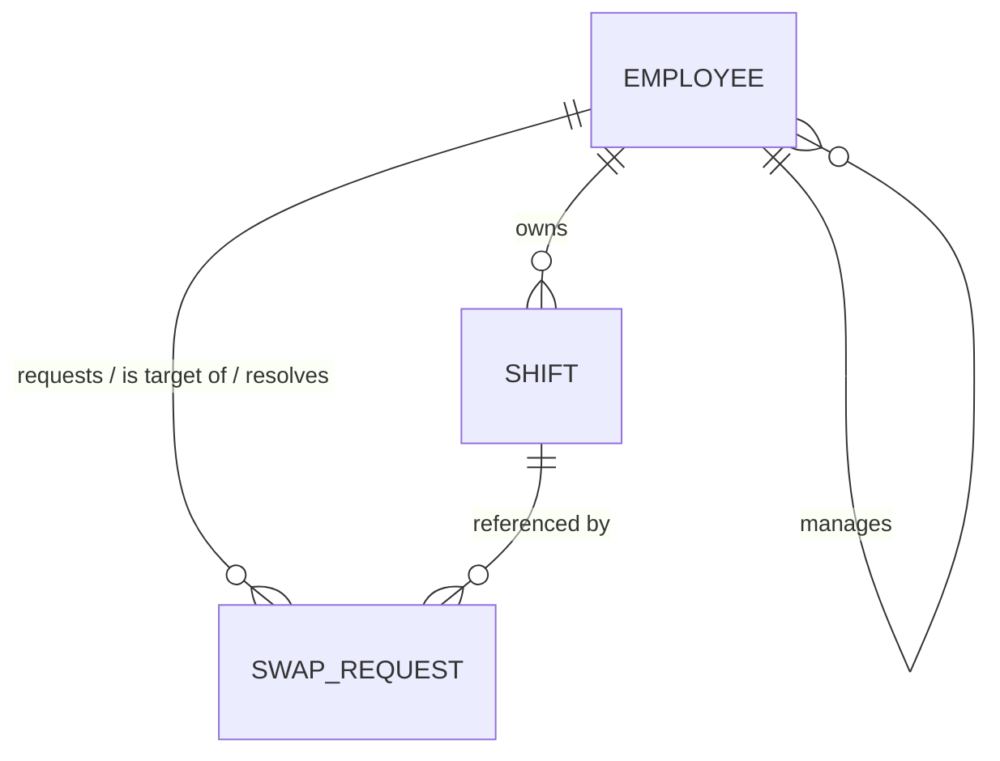
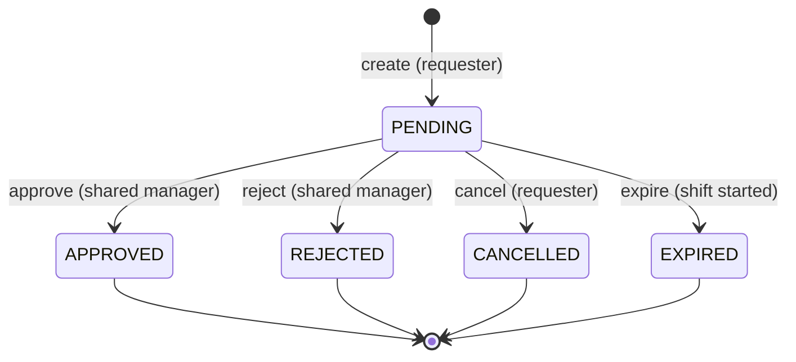

# Shift Swap Service

**Problem:** A small service that lets one employee request a shift swap with another employee, and lets a manager approve or reject the request.

This note covers requirements, the design (data model, state machine, API, business rules), the reasoning behind each non-obvious decision, and the operational sections (security, observability, testing, failure modes, deployment). Concrete artifacts — source, tests, `Dockerfile`, `docker-compose.yml`, CI workflow — live alongside this document; the README covers setup and run instructions. The deliverable is local-first; multi-environment concerns are covered as reasoned notes.

---

## 0. Document Overview

- **Purpose** : record the design and the full-SDLC reasoning for the Shift Swap Service.
- **Organization** : requirements (incl. clarifying questions) and out-of-scope first; then the concrete design (architecture, data model, state machine, API, business rules); then Design Decisions (the "why," once); then operational sections; then AI-assistance log, and future work.
---

## 1. Requirements

### 1.1 Clarifying questions & assumed answers (requirements-clarification phase)
The problem statement is deliberately terse, so before designing I identified the decisions a PM/stakeholder would need to settle. Each is a question I would ask; in their absence I state the answer I assumed and designed to.

| Question I'd ask | Assumed answer (designed to) |
|---|---|
| Does the target employee need to consent before the manager decides? | No, the manager is the sole approval gate (spec-literal). Target has visibility, no action in v1. |
| Can a swap cross teams (employees under different managers)? | No, both employees must share a manager in v1; the shared manager approves. |
| What does "swap" mean — trade ownership of the two shift records, or edit shift times? | Exchange ownership of the two existing shift records; no time editing. |
| Is there a cutoff window before a shift starts (e.g. no swaps within N hours)? | No cutoff in v1, a future shift is swappable up to its start instant. |
| Can the reporting structure change during a request's lifetime (reorg)? | Assumed stable for a request's lifetime. |
| Can an employee be deactivated / leave mid-request? | Assumed not, for this deliverable (a stable workforce).|
| Can a manager be a party to a swap they'd approve? | Out of scope, managers act only as approvers here; separation of duties is enforced anyway. |
| Any limit on concurrent requests? | One active (PENDING) request per shift; no per-employee cap. |

### 1.2 Functional requirements
- An employee can request to swap one of their own **future** shifts with another employee's **future** shift.
- A manager can approve a pending request; approval **atomically** exchanges ownership of the two shifts.
- A manager can reject a pending request.
- A requester can cancel their own pending request.
- A swap is permitted only between two employees who report to the same manager; that shared manager is the approver.
- A pending request whose shift has started becomes **EXPIRED** rather than lingering as actionable.
- The **resolution** of a request is recorded who resolved it, when, and the outcome for auditability.
- Requests can be fetched and listed, scoped to what the caller is authorized to see.

### 1.3 Quality requirements
- **Atomicity**: an approved swap is all-or-nothing; shifts are never left half-swapped.
- **No double-booking**: a swap never leaves an employee holding two overlapping shifts (an internal scheduling invariant, enforced at create and approve).
- **Idempotency**: repeating a decision on an already-resolved request has no further effect.
- **Authorization**: identity is resolved server-side; authority (ownership + manager-scoping) is enforced server-side, never trusted from the client.
- **Confidentiality**: a caller cannot read or infer the existence of requests they aren't party to.
- **Liveness**: while its shifts are in the future a PENDING request is always resolvable by an authorized actor (approve/reject/cancel); once a shift starts it expires.

### 1.4 Non-functional targets (assumed, stated so downstream choices are anchored)
| Dimension | Target / assumption | Consequence in the design |
|---|---|---|
| Scale | ≤ ~5k employees, ≤ ~50k shifts, low tens of requests/sec peak | single service + single relational DB; pagination deferred with a stated ceiling |
| Latency | p99 < 300 ms reads, < 500 ms writes at this scale | simple indexed queries; short critical sections on the swap path |
| Availability | best-effort single instance for this deliverable; design must not *prevent* horizontal scaling | stateless service; all coordination in the DB |
| Consistency | strong; a half-swapped pair, a double-booked employee, or two active requests on one shift are bugs, never "eventual" | transactional swap; DB-enforced invariants; explicit concurrency control |
| Auditability | the resolution of every request is reconstructable | resolution fields on the request; per-transition event log is out of scope |

---

## 2. Out of Scope

Each exclusion is a deliberate scope choice; where an exclusion touches a system invariant, the invariant is still protected.

- **Counterparty (target) consent.** The spec names the manager as the sole gate. The single-hop state machine lets a `PENDING_TARGET` step be inserted later. The target can see requests naming them but cannot act in v1.
- **Cross-manager swaps.** v1 requires a shared manager; the extension (lowest-common-ancestor approver, or dual sign-off) needs no schema change since `managerId` is self-referential.
- **Employee deactivation / lifecycle.** Assumed away (a stable workforce). This removes deactivation-driven stranded requests; the only remaining expiry is temporal.
- **Per-transition audit history.** The resolution is recorded on the request; a full append-only event log is deliberately not built — justified mainly by a future consent state, so speculative now.
- **Notifications** (email/push on create/decide). Event-driven add-on.
- **External calendar integration.** Only external *sync* is out of scope. Preventing double-booking *within* this system is in scope and enforced — it is a core scheduling invariant, not a calendar concern.
- **Real authentication.** The service resolves identity from an `X-User-Id` header stand-in for local runnability; real auth (a JWT bearer validated by an OAuth2 resource server / OIDC IdP) is documented as the production path (§9.1). Authority is DB-derived regardless, so swapping in real auth does not change the authorization logic.
- **UI.** API-only; Swagger UI is the interactive surface.
- **Multi-environment infrastructure.** Local-first (Docker Compose); staging/prod, Kubernetes, cloud provisioning are reasoned notes in §13.
- **Migration tooling.** JPA-managed schema (`ddl-auto: update`) in *every* profile shipped with this deliverable, including the `docker`/Postgres one — Flyway is not wired up anywhere yet. It remains the recommended production path and the vehicle for the partial unique indexes, but treat both as a next step, not a current artifact.

---

## 3. Architecture Overview

A single **Spring Boot** service with conventional layering. The domain is one small aggregate (a swap request over two shifts) with synchronous, transactional operations — microservices, an event bus, or CQRS would add coordination cost with no benefit at this scale.

```
HTTP client (curl / Swagger UI / future frontend)
        │
        ▼
[ Identity filter ]  reads X-User-Id, resolves it to an Employee (id + manager)
        │            — the single seam where real auth (JWT/OIDC) plugs in (§9.1)
        ▼
   Web layer         controllers, DTOs, validation, global exception handler
        ▼
   Service layer     business rules, state machine, transaction boundary
        ▼             (the correctness core — §7)
   Repository layer  Spring Data JPA (no business logic)
        ▼
   Database          H2 (local run + tests)  |  Postgres 16 (docker compose)
```

- **All business rules and authorization live in the service layer**, so no alternate entry point bypasses them, and they unit-test without a web server or DB.
- **The service is stateless** — every invariant is enforced by the database, keeping the door open to running multiple instances later.
- **Error mapping is centralized** in one exception handler; every endpoint returns the same error shape.
- **Frontend compatibility.** Stateless JSON API; a browser frontend needs CORS enabled for its origin and sends the identity header (a bearer token in production). CORS is off by default since there's no frontend in this deliverable.

---

## 4. Data Model

### 4.1 Entities
One **Employee** entity represents everyone. "Manager" is not a stored role but a *position* derived from the reporting edge (`managerId`): you can decide a request iff you are the current manager of both parties. Requester and target are just employees in specific relationships to a request.


**Employee**

| Field | Type | Notes |
|---|---|---|
| `id` | Long PK | seeded reference data; readable in the demo |
| `name` | String | |
| `email` | String, unique | natural key for a future auth layer. **PII** — never logged; returned only to the employee themself |
| `title` | String | display only; never used for permissions |
| `managerId` | Long FK -> Employee, nullable | sole basis of approval authority. Constraint `managerId != id` (no self-management — closes the manager-as-own-approver path) |

**Shift**

| Field | Type | Notes |
|---|---|---|
| `id` | Long PK | |
| `employeeId` | Long FK -> Employee | current owner; changes only via an approved swap |
| `startsAt` / `endsAt` | Instant (UTC) | constraint `endsAt > startsAt`; local rendering is presentational |
| `version` | Long | optimistic-lock column; also the damage backstop for the concurrent-create race |

**SwapRequest**

| Field | Type | Notes |
|---|---|---|
| `id` | UUID PK | **server-generated** — appears in URLs, so non-enumerable |
| `requesterId` | Long FK -> Employee | |
| `requesterShiftId` / `targetShiftId` | Long FK -> Shift | |
| `targetEmployeeId` | Long FK -> Employee | snapshotted at creation — approval changes the shift's owner, so the request must preserve who the target *was* |
| `status` | enum | `PENDING`, `APPROVED`, `REJECTED`, `CANCELLED`, `EXPIRED` |
| `reason` | String(500), nullable | requester's note |
| `resolutionNote` | String(500), nullable | note recorded at resolution (manager's rationale on approve/reject) |
| `createdAt` | Instant | |
| `resolvedAt` / `resolvedBy` | Instant / Long FK, nullable | who/when moved it out of PENDING — the requester on cancel, the manager on approve/reject, `null` actor on temporal expiry. Named `resolved*` (not `decided*`) since cancel and expiry are resolutions, not decisions |
| `version` | Long | optimistic lock for concurrent decisions |

### 4.2 Relationships


### 4.3 Indexes
Designed from the queries:

| Query | Index |
|---|---|
| "is this shift in an active request?" (hot path) | `swap_request(requester_shift_id, status)`, `swap_request(target_shift_id, status)` |
| approval queue (`to-approve`) / managed list | `employee(manager_id)` to find reports; `swap_request(status, created_at)` for ordering. *(The queue is "PENDING requests of my reports" — a join through `employee(manager_id)`; the composite index serves ordering, the manager index serves the join. Adequate at §1.4 volumes.)* |
| participation view (`scope=mine`) | `swap_request(requester_id, status)`, `swap_request(target_employee_id, status)` |
| shifts by owner + overlap check | `shift(employee_id, starts_at)` |

### 4.4 Model-level (DB) constraints
Declared in the entity model via Hibernate annotations (`@Check`, `@Column(unique=…)`), so Hibernate's own DDL generation enforces them today in *every* profile — local H2 and the docker Postgres profile alike, since neither uses Flyway yet:
- `CHECK (manager_id IS NULL OR manager_id <> id)` — no self-management.
- `CHECK (ends_at > starts_at)` — shift sanity.
- Uniqueness on `employee.email`.
- **Partial unique index — not built.** The design calls for unique `(requester_shift_id) WHERE status = 'PENDING'` and `(target_shift_id) WHERE status = 'PENDING'` as DB-level enforcement of "one PENDING request per shift," backstopping the concurrent-create race. This needs a real migration tool (Hibernate can't express a partial/conditional unique index declaratively), so it doesn't exist in any profile yet, including docker/Postgres. Today, in every profile, the guarantee rests entirely on the service-layer check plus `Shift.version` — the index remains a recommended production hardening step, not a current hard stop. Tracked in Future Work.

## 5. State Machine

Modeled explicitly — one guarded transition function in the service layer, not scattered `if (status == …)` checks — so legal transitions, idempotency, and atomicity have a single enforcement point.

### 5.1 States
| State | Meaning | Terminal? | Actor |
|---|---|---|---|
| `PENDING` | Awaiting the shared manager's decision | No | — |
| `APPROVED` | Shifts have been swapped | Yes | shared manager |
| `REJECTED` | Declined; no swap | Yes | shared manager |
| `CANCELLED` | Withdrawn before resolution | Yes | requester |
| `EXPIRED` | An involved shift has started; the swap can no longer take effect | Yes | system |

### 5.2 Diagram


### 5.3 Expiry & liveness
With a stable workforce and stable org structure assumed, the **only** reason a PENDING request becomes un-actionable is temporal: an involved shift starts, after which the swap can't take effect. So there is exactly one expiry trigger — `startsAt ≤ now` on either shift.

- **Expiry-on-transition (safe reads):** every attempted transition (approve/reject/cancel) first checks the temporal condition; if met it transitions the request to `EXPIRED` (`resolvedBy = null`) and returns `409 REQUEST_EXPIRED`.
- **Effective status on reads (reads never mutate):** a `GET` computes the *effective* status — a stored-`PENDING` request whose shift has started is reported as `EXPIRED` without a write, so reads are truthful and still safe/idempotent. The `to-approve` queue filters out requests whose shifts have already started, so a manager's queue never lists an un-approvable item.
- **Liveness:** while both shifts are in the future the request is always resolvable by an authorized actor (manager approve/reject, requester cancel).
- **Residual:** a started-shift request still holds its *other* (possibly still-future) shift in the "one PENDING per shift" slot until someone next touches it. This is narrow and accepted at this scope; the trivial closer — evaluating expiry on the blocking request when a *create* conflicts on that shift — is named in Future Work. No scheduler is built.

### 5.4 Approval — the contested path
```mermaid
sequenceDiagram
    participant M as Manager
    participant S as Service (one transaction)
    participant DB as Database
    M->>S: POST /swap-requests/{id}/approve
    S->>DB: load request (+ shifts, parties)
    S->>S: temporal expiry check — may transition to EXPIRED, return 409
    S->>S: guards: still PENDING; caller is both parties' current manager
    S->>S: ownership matches snapshot; both shifts still future; no overlap results
    S->>DB: swap the two shift.employeeId values (versioned writes)
    S->>DB: request → APPROVED, resolvedAt/By set
    S->>DB: commit (any failure rolls back everything)
    S-->>M: 200 (or a specific 4xx code)
```

### 5.5 Transitions
| From | To | Trigger | Actor | Guard | Effect |
|---|---|---|---|---|---|
| — | `PENDING` | create | requester | ownership; shared manager; both shifts future; no overlap; neither shift in an active request | persist `PENDING`, `createdAt` |
| `PENDING` | `APPROVED` | approve | shared manager | still `PENDING`; not expired; caller manages both; ownership matches; no overlap | swap owners atomically; set `resolved*` |
| `PENDING` | `REJECTED` | reject | shared manager | same authority; still `PENDING` | set `resolved*`; no swap |
| `PENDING` | `CANCELLED` | cancel | requester | still `PENDING`; caller is requester | set `resolved*` (= requester); no swap |
| `PENDING` | `EXPIRED` | expire | system | an involved shift has started (at a transition attempt or as effective status) | set `status`, `resolvedAt`, `resolvedBy = null` |

### 5.6 Illegal transitions & idempotency
Any trigger on a non-PENDING request -> **409 Conflict** naming the terminal state. One rule yields both properties: retried/duplicate decisions have no further effect, and no request can swap shifts twice. Re-deciding returns 409 (not a silent 200) so duplicate/conflicting decisions stay visible to clients and tests.

---

## 6. API Design

### 6.1 Conventions
- Base path **`/api/v1`** — versioned from day one; prevents a breaking-change trap later.
- JSON in/out. Identity via the `X-User-Id` header; missing or unknown -> `401`. In production this header is replaced by an `Authorization: Bearer` JWT validated at the resource server; nothing else in the API changes.
- Request IDs are UUIDs in paths; employee/shift IDs are Longs in bodies.
- Lifecycle actions are **sub-resources** (`/approve`, `/reject`, `/cancel`) — each transition separately authorizable; clients can't drive the machine with arbitrary status values.

### 6.2 Endpoints
**Swap requests**

| Method | Path | Authorized caller | Success |
|---|---|---|---|
| POST | `/api/v1/swap-requests` | any employee (own shift) | 201 |
| GET | `/api/v1/swap-requests/{id}` | party or shared manager | 200 |
| GET | `/api/v1/swap-requests?scope=&status=&employeeId=` | scoped to caller | 200 |
| POST | `/api/v1/swap-requests/{id}/approve` | shared manager | 200 |
| POST | `/api/v1/swap-requests/{id}/reject` | shared manager | 200 |
| POST | `/api/v1/swap-requests/{id}/cancel` | requester | 200 |

**Directory (read-only, discovery / UI support)**

| Method | Path | Authorized caller | Success |
|---|---|---|---|
| GET | `/api/v1/employees?scope=colleagues\|reports` | authenticated (results scoped) | 200 |
| GET | `/api/v1/employees/{id}/shifts` | self / same-manager peer / that employee's manager (others: 404) | 200 |

`scope` on the list endpoint: `mine` (default — caller is requester or target), `to-approve` (PENDING requests of the caller's **direct reports**, excluding started-shift requests — the approval queue), `managed` (all requests of the caller's **direct reports**, any status; combinable with `status`, and with `employeeId` which must be a direct report — a non-report `employeeId` yields an empty result, never a leak). Direct-reports-only (not the transitive subtree) is the v1 rule; subtree scoping is future work. There is no unscoped listing.

### 6.3 Create
```
POST /api/v1/swap-requests
X-User-Id: 1
{ "requesterShiftId": 10, "targetShiftId": 22, "reason": "Doctor's appointment" }
```
`requesterId` comes from the identity header — never the body; `targetEmployeeId` is derived server-side from the target shift's owner (snapshotted). To avoid an enumeration side channel, a `targetShiftId` that doesn't exist and one that exists but is outside the caller's scope return the **same** response (a generic `422`), so create cannot be used to probe which shift IDs exist across the org. A retried create fails with `409 SHIFT_ALREADY_IN_REQUEST` (the one-PENDING-per-shift rule makes duplicates impossible); an `Idempotency-Key` to let a client distinguish its own retry from a genuine conflict is noted as future work.
```
201 Created
Location: /api/v1/swap-requests/b1f2c3d4-…
{ "id": "b1f2c3d4-…", "status": "PENDING", "requesterId": 1, "requesterShiftId": 10,
  "targetEmployeeId": 2, "targetShiftId": 22, "reason": "Doctor's appointment",
  "resolutionNote": null, "createdAt": "2026-01-15T09:00:00Z",
  "resolvedAt": null, "resolvedBy": null }
```

### 6.4 Approve / Reject / Cancel
`POST …/{id}/approve` with optional `{ "resolutionNote": "Coverage confirmed" }` → 200 with the resolved representation. `reject` identical in shape, no swap. `cancel` by the requester → `CANCELLED`, `resolvedBy = requester`. On any `409` the body includes the current resolved representation (`status`, `resolvedBy`) so a client whose call timed out can tell what actually happened; client guidance: on 409, GET the resource to observe the outcome.

### 6.5 Error model
One shape everywhere, with a stable machine-readable `code`:
```json
{ "timestamp": "2026-01-15T10:30:00Z", "status": 409, "error": "Conflict",
  "code": "INVALID_STATE_TRANSITION",
  "message": "Request is already APPROVED and cannot be changed",
  "path": "/api/v1/swap-requests/b1f2c3d4-…/approve" }
```

### 6.6 Status codes and codes (single source of truth — tests assert against this table)
| HTTP | Code | Trigger |
|---|---|---|
| 400 | `VALIDATION_ERROR` | missing/malformed fields; invalid UUID; `requesterShiftId == targetShiftId`; note > 500 chars |
| 401 | `UNAUTHENTICATED` | `X-User-Id` missing, or not a known employee |
| 403 | `FORBIDDEN` | caller is not the shared manager (decide) / not the requester (cancel) |
| 404 | `NOT_FOUND` | referenced entity absent, or a request the caller may not read |
| 409 | `INVALID_STATE_TRANSITION` | transition from a terminal state |
| 409 | `SHIFT_ALREADY_IN_REQUEST` | shift already in an active request (incl. un-keyed create retry) |
| 409 | `REQUEST_EXPIRED` | temporal expiry fired during this transition (an involved shift has started) |
| 409 | `CONCURRENT_MODIFICATION` | optimistic-lock conflict on simultaneous decisions |
| 422 | `SHIFT_NOT_OWNED` / `SELF_SWAP_NOT_ALLOWED` / `DIFFERENT_MANAGERS` / `SHIFT_IN_PAST` / `OVERLAP_CONFLICT` / generic reference error | business-rule violations at create/approve (the generic form also masks non-existent vs out-of-scope target shifts) |

Demarcation, stated once: 403 = who you are; 409 = the state of the world; 422 = the request itself violates a domain rule.

### 6.7 Unauthorized reads return 404, not 403
A 403 on a read confirms the request exists; existence is masked as 404 for single-request GETs and for directory reads outside the caller's scope. Action endpoints still return 403 where the caller legitimately knows the request exists (e.g. the target attempting to cancel). Combined with the create-path masking, there is no existence oracle on read or write.

---

## 7. Business Rules, Invariants, Concurrency

All rules live in the service layer; each maps to at least one test. Field-level validation (shape) precedes domain validation (rules over stored data).

### 7.1 Field-level (400 `VALIDATION_ERROR`)
`X-User-Id` present and numeric; shift IDs present, positive, distinct; `reason`/`resolutionNote` ≤ 500 chars; path `{id}` a well-formed UUID.

### 7.2 Create rules
1. Both shifts and both employees exist → else 404 (or generic 422 for an out-of-scope/non-existent target shift).
2. Requester owns `requesterShiftId` → else 422 `SHIFT_NOT_OWNED`.
3. Target (owner of `targetShiftId`) is not the requester → else 422 `SELF_SWAP_NOT_ALLOWED`.
4. Both shifts start in the future → else 422 `SHIFT_IN_PAST`. Swapping a started shift would retroactively rewrite who worked it.
5. Requester and target share the same non-null manager → else 422 `DIFFERENT_MANAGERS`.
6. **The prospective swap creates no overlap for either employee** — the requester would take the target shift; check it against the requester's other shifts, and the target shift against the target's other shifts → else 422 `OVERLAP_CONFLICT`. One indexed range query per party.
7. Neither shift is in another PENDING request → else 409 `SHIFT_ALREADY_IN_REQUEST`.
8. On success: snapshot `targetEmployeeId`, `status = PENDING`.

### 7.3 Decision rules (approve / reject)
1. Exists → else 404.
2. Temporal expiry check first (§5.3) — if a shift has started → 409 `REQUEST_EXPIRED`.
3. Still PENDING → else 409 `INVALID_STATE_TRANSITION`.
4. Caller is the **current** manager of both parties → else 403. Authority is evaluated **at decision time**.
5. **Approve, in one transaction:** ownership still matches the snapshot; both shifts still future; **the swap would create no overlap for either employee** (re-checked here, since other shifts may have changed since create) → exchange the two `employeeId` values (versioned writes), set `resolved*`. If the ownership re-check fails (data repair / bypassed invariant), transition to `EXPIRED`, return `409 REQUEST_EXPIRED`.
6. **Reject:** resolve with no swap.
7. **No self-resolution:** the resolver may not be the requester or the target. The `managerId ≠ id` constraint already makes this unreachable through normal data; the guard is defense-in-depth.

### 7.4 Cancel rules
Exists → 404; temporal expiry check; still PENDING → 409; caller is the requester → else 403; resolve as `CANCELLED` (`resolvedBy = requester`).

### 7.5 Read rules
Single GET: party or shared manager; others → **404** (§6.7); status reported as effective (§5.3). Lists: always scoped (§6.2). Directory: colleagues = same manager, excluding caller; shifts readable by self, same-manager peer, or that employee's manager (others → 404).

### 7.6 System invariants (always hold)
1. A shift has exactly one owner at all times.
2. A shift is in at most one PENDING request (service check + `Shift.version` as the enforcement today, in every profile; a Postgres partial unique index would make this a hard DB-level guarantee but isn't built yet — §7.8).
3. Terminal requests never change.
4. An approved swap exchanges exactly two owners, atomically.
5. No employee holds two overlapping shifts as a result of this service's actions.

### 7.7 Edge cases
- Top-of-tree employee (`managerId = null`): cannot create (rule 7.2.5 fails); can decide only as both parties' manager.
- Manager-as-party: unreachable via rule 7.2.5 + the `managerId ≠ id` constraint; independently blocked by 7.3.7.
- Reorg / deactivation mid-flight: assumed away (§1.1); if introduced later, the expiry mechanism generalizes to those triggers.

### 7.8 Concurrency control
- **Race A — concurrent decisions on one request** (two managers, or a double-clicked approve): closed by **optimistic locking** via `SwapRequest.version`. One commits; the other gets `409 CONCURRENT_MODIFICATION`. Built and tested.
- **Race B — concurrent creates on the same shift** (two creates both pass "no active request exists" before either inserts): today closed only by the service-layer check plus `Shift.version` as a damage backstop, in *every* profile — the **partial unique index** that would make two simultaneous PENDINGs impossible at the DB level is not built yet, since neither profile uses Flyway. So currently: two PENDINGs on one shift is possible in principle if the check-then-act window is hit; `Shift.version` still caps the damage — two PENDINGs could lead to two approval *attempts*, but the second approval's versioned shift-write fails with a lost-update conflict, so no double swap occurs (asserted by test — §11). The partial unique index, plus an ordered `SELECT … FOR UPDATE` on both shift rows during create (to turn the second create's failure into a clean pre-check instead of a race), are both future work.

---

## 8. Design Decisions

Format: **choice → alternative → why**.
**8.1 — Requests are immutable; change = cancel + recreate.** *Alt:* edit endpoint. *Why:* a request is a record of intent; editing blurs the audit trail and bloats the state machine.

**8.2 — One Employee table; manager is a relationship, not an entity.**

**8.3 — Authorization is relationship-derived; no stored role.** *Alt:* a `role` column. *Why:* "can decide this request" is fully determined by `managerId`; a stored flag is redundant state that drifts. A system with many permission types would want explicit roles — out of scope here.

**8.4 — Server-generated UUID for request IDs; Longs for employees/shifts.** Request IDs appear in URLs -> non-enumerable; internal reference data stays readable for the demo.

**8.5 — Transitions as sub-resources, not `PATCH {status}`.** Each transition separately authorizable; clients can't drive the machine with arbitrary values.

**8.6 — Optimistic locking for decisions; the create race is bounded by `Shift.version` as a damage backstop today, not closed by a full pessimistic-lock tier.** A Postgres partial unique index would close the check-then-act window entirely but is not built — Flyway isn't wired up in any profile yet. *Alt:* ordered `FOR UPDATE` on both shift rows + a concurrency test tier for creates. *Why:* `version` already prevents a double swap even without the index; the index itself is declarative and low-risk once Flyway exists; the ordered-lock refinement is disproportionate here. Both are named in Future Work.

**8.7 — The approval swap runs in a single transaction.** Two shift writes + the request update are all-or-nothing.

**8.8 — `EXPIRED` state, temporal-only, with expiry-on-transition and effective-status-on-read.** *Alt:* multi-trigger expiry (deactivation/reorg) + a sweeper. *Why:* with a stable workforce/org assumed (§1.1), the only un-actionable cause is a started shift. Evaluating it on transitions (and computing effective status on reads) keeps reads safe and the queue honest without a scheduler.

**8.9 — Resolution recorded on the request; no append-only event log.** A single-hop machine's resolution is captured by `status` + `resolved*`; a full event log is justified mainly by a future consent state. Future work.

**8.10 — Temporal (`SHIFT_IN_PAST`) *and* double-booking (`OVERLAP_CONFLICT`) guards are in scope.** *Alt:* treat both as calendar concerns. *Why:* retroactive swaps and double-booking are internal scheduling invariants of this service's write path — the core of the domain — not external-calendar integration.

**8.11 — Identity via an `X-User-Id` header stand-in; real auth (JWT/OIDC resource server) documented as the production path.** *Alt:* build the JWT resource server now; HTTP Basic. *Why:* the deliverable's value is the scheduling core, not an auth subsystem. The header stand-in exercises real *server-side authorization* (authority is DB-derived regardless) while keeping the service runnable with zero auth setup; the identity filter is the single seam where a resource server drops in (§9.1). This deliberately reverts an earlier JWT design that over-invested in auth relative to the domain.

---

## 9. Security & Privacy Review

### 9.1 Authentication — stand-in, with the production path specified
- Locally, identity is the `X-User-Id` header, resolved to an Employee; unknown/missing → `401`. This is explicitly a **stand-in**: it performs no credential verification and is trusted only because the service is local. It is *not* presented as production auth.
- **Production path:** the header is replaced by an `Authorization: Bearer <JWT>` validated by Spring Security's OAuth2 resource server against an OIDC IdP (signature, `exp`/`nbf`, `iss`, `aud`), with `sub` = employee id resolved to an Employee. Only the identity filter changes; every authorization rule is unaffected because **authority is always derived from `managerId`, never from a token claim** — so a reorg takes effect on the next request, not the next token.
- Because authority is DB-derived, the security posture does not depend on the identity mechanism: the header stand-in and a real IdP enforce the *same* server-side rules.

### 9.2 Authorization
Server-side in the service layer, per request: decide = current manager of both parties; cancel = requester; reads = party/manager with 404 masking. No client-supplied value participates in an authorization decision.

### 9.3 Transport
TLS terminated at the gateway/ingress in any real deployment. The service binds plain HTTP only inside the compose network. CSRF is not applicable — no cookies/sessions.

### 9.4 PII
Stored PII: `name`, `email`. Handling: email is **never logged**, never in list/directory responses (which return `id`, `name`, `title` only), and returned only to the employee themself. Employee *ids* may appear in logs (pseudonymous, for audit correlation). `reason`/`resolutionNote` are free text — never logged, length-bounded, returned only to authorized readers.
**Retention/deletion (noted):** resolved requests are retained for audit (e.g. a defined period); this deliverable does not implement deletion — a data-subject deletion/anonymization flow (redacting `reason`/`resolutionNote`, tombstoning employee rows) is future work.

### 9.5 Secrets
DB credentials via environment only (compose reads a git-ignored `.env`; CI uses repository secrets). No secret has a production default; a missing secret fails startup rather than falling back silently.

### 9.6 Input handling & injection
Bean Validation on DTOs; UUIDs parsed before use; all persistence via JPA parameterized queries — no string-built SQL. Note fields bounded (500). A dependency/image vulnerability scan (Trivy or OWASP dependency-check) is the cheapest supply-chain evidence and is included as a CI step (§13.2).

---

## 10. Observability

- **Health:** Actuator liveness + readiness; readiness includes a DB ping so a canary gates on real dependency health.

- **Metrics (Micrometer, built):** `swap.requests` tagged by `outcome` (`created|approved|rejected|cancelled|expired`, one increment per successful transition, incl. system-triggered expiry) — **not** five separately-named counters as originally drafted (`swap.requests.created` collided with Prometheus/OpenMetrics's reserved `_created` companion-series suffix: the exposed series silently lost its "created" qualifier and collapsed into a bare `swap_requests_total`, confirmed live via `/actuator/prometheus` — tagging sidesteps it and reads as `swap_requests_total{outcome="created"}` etc.); `swap.conflicts` tagged by error `code` — scoped to the 409 family (`INVALID_STATE_TRANSITION`, `REQUEST_EXPIRED`, `SHIFT_ALREADY_IN_REQUEST`, `CONCURRENT_MODIFICATION`), matching the 403/409/422 demarcation in §6.6; `identity.failures` (unknown/missing `X-User-Id`); HTTP p50/p99 per endpoint via Actuator's built-in `http.server.requests` timer (no custom code needed). All three custom counters live in one `SwapMetrics` component so instrumentation and the alert signals can't drift apart. §13.6's `swap.conflicts{code=CONCURRENT_MODIFICATION}` and `swap.requests.expired` signal names should now be read as `swap_conflicts_total{code="CONCURRENT_MODIFICATION"}` and `swap_requests_total{outcome="expired"}`.

- **Logging (built, partially):** correlation id in MDC (`X-Request-Id` honored via `CorrelationIdFilter`, generated otherwise, echoed back as a response header, embedded in every log line via `logging.pattern.level`). One INFO line per transition: `{requestId, fromStatus, toStatus, actorId, trigger}` — `trigger` (`CREATE`/`APPROVE`/`REJECT`/`CANCEL`/`EXPIRE`) rather than the §6.6 error `code`, since this line covers *successful* transitions; the `code` field is what `swap.conflicts` tags. **Not built:** JSON-structured log output — logs are plain SLF4J text today, not JSON-encoded (would need a Logback JSON encoder dependency + config). Never logged: emails, note bodies, full entities.

- **Tracing:** OpenTelemetry is a production note; correlated logs (via the MDC correlation id above) suffice locally.

---

## 11. Testing Strategy

Tiers, all run by `mvn verify` and gating CI.

**Unit (plain JUnit, no Spring context):** transition guards for every state × trigger pair; authority derivation (shared manager, top-of-tree); temporal rule; overlap rule against crafted shift sets; effective-status computation.

**Integration (MockMvc + H2):** full HTTP cycles; identity via `X-User-Id`; asserts the exact `code` from §6.6.

**Concurrency (targeted):** parallel approve+approve on one request → assert exactly one success, one `409 CONCURRENT_MODIFICATION`, and a single swap (Race A). A concurrency test asserts the `Shift.version` lost-update backstop for Race B: two PENDING requests seeded to share a shift (simulating the create-time race the service-layer check doesn't fully close today), approved concurrently → assert no double swap, exactly one ends up `APPROVED`. A Postgres partial-unique-index test is future work, since the index itself isn't built yet.

**Edge cases:**
- Decide a terminal request → `409 INVALID_STATE_TRANSITION`.
- Approve after an involved shift started → `409 REQUEST_EXPIRED`, row now `EXPIRED`.
- Create a past shift → `422 SHIFT_IN_PAST`; a swap that would double-book either party → `422 OVERLAP_CONFLICT`; self-swap → `422 SELF_SWAP_NOT_ALLOWED`; unowned shift → `422 SHIFT_NOT_OWNED`; cross-manager parties → `422 DIFFERENT_MANAGERS`.
- Shift already in an active request → `409 SHIFT_ALREADY_IN_REQUEST`.
- Non-manager decides → `403`; unauthorized single GET → `404`; target attempts cancel → `403`.
- Missing/unknown `X-User-Id` → `401`.
- Create with a non-existent vs out-of-scope target shift → identical generic `422` (no existence oracle).

---

## 12. Failure Modes

**Retries.** Decisions are idempotent-by-guard (repeat → 409, no side effect, with the resolved representation in the body); creates are duplicate-proof via one-PENDING-per-shift (→ 409). Guidance: retry only on 5xx/timeouts, then GET to reconcile.

**Partial failures.** Approval writes three rows (two shifts + the request) in one transaction — any failure rolls back all of it; shifts are never half-swapped. DB unavailability surfaces as failed readiness → the instance is pulled from rotation.

**Concurrency.** Race A (duplicate decisions) closed and tested via optimistic version. Race B (concurrent creates) is bounded, not eliminated: the service-layer check plus `Shift.version` prevent a double swap (tested), but the DB-level partial unique index that would close the check-then-act window entirely is not built yet.

**Permissions / data leakage.** Authority re-derived from the DB every request; unauthorized reads and out-of-scope directory reads masked as 404; the create path masks shift existence; every list scoped; emails never logged. The identity header is a known stand-in (spoofable by design) — production auth closes that, and because authority is DB-derived, no authorization logic changes when it does.

**Rollback interaction.** Schema changes are expand/contract so a rolled-back app version can run against the newer schema.

---

## 13. Deployment, Rollout, Rollback, Monitoring

### 13.1 Built artifacts
- **Multi-stage `Dockerfile`:** Maven build stage → slim JRE runtime; non-root user; pinned base images.
- **`docker-compose.yml`:** `app` + `db` (Postgres 16) with a DB healthcheck and `depends_on: condition: service_healthy`; config via environment; fails fast if DB credentials are unset; a named volume for Postgres data and a `restart: unless-stopped` policy.
- **Spring profiles:** `local` = H2; `docker` = Postgres with required secrets. Same JPA code; datasource swapped by config.

### 13.2 CI (`.github/workflows/ci.yml`)
Checkout → JDK 21 → `mvn verify` (unit + integration + concurrency) → dependency/image vulnerability scan (Trivy) → build the Docker image. Image push on tag outlined; secrets via repository settings.

The Trivy step runs with `exit-code: '0'` — **intentionally report-only, not a CI gate, for this deliverable.** There's no triage process yet to distinguish an acceptable transitive CVE from one that should block a merge, so failing the build on every HIGH/CRITICAL finding would be noise, not signal. Flipping it to `exit-code: '1'` (and adding an ignore-list for accepted findings) is the natural next step once that triage process exists.

### 13.3 Environments
Local (H2, zero setup) → compose (real Postgres, env-injected secrets) → cloud notes: any container platform; externalized/managed Postgres; a real IdP replaces the identity header; TLS at ingress.

### 13.4 Migration strategy

**Not built.** Every profile shipped with this deliverable — local H2 and docker Postgres alike — uses Hibernate's `ddl-auto: update`. That is fine for a demo and unacceptable for production: it is opaque, it can silently do the wrong thing, and it leaves no audit trail of what schema is applied where.

**Production path — Flyway.** Versioned SQL migrations under `db/migration`, applied on startup, with a `flyway_schema_history` table recording exactly which versions are applied to which database. Two consequences follow:

- The **partial unique indexes** ride on this. Hibernate cannot express a conditional (`WHERE status = 'PENDING'`) unique index declaratively, so they land as a migration, not an annotation. This is why they don't exist today.
- All changes follow **expand/contract** (add → backfill → migrate reads/writes → remove). Old and new application versions can therefore run against the same schema during a rollout, which is precisely what makes the canary in §13.5 and the rollback in §13.6 safe.

**Schema rollback is roll-forward.** Ship a corrective migration; never rewrite applied history. Destructive down-migrations against a live database are how data gets lost. Because changes are expand/contract, a rolled-back application version still runs against the newer schema.

### 13.5 Rollout
Immutable image tags; canary dial-up (0% → small % → 100%) gated on §13.6 signals; readiness (incl. DB ping) gates traffic shifting. New/risky endpoints behind a feature flag (a config property / env var) so disabling never requires a redeploy.

### 13.6 Rollback, backup & monitoring signals
**App rollback:** redeploy the previous immutable tag — minutes, no build. **Schema:** roll forward with a corrective migration; never rewrite applied history. **Backup/DR:** production uses managed Postgres with point-in-time recovery; compose volumes are ephemeral demo state. **Signals (mapped to §10 metrics, each with a threshold + duration + owner in a real runbook):** sustained 5xx over a rolling window; p99 over the §1.4 budget; `swap_conflicts_total{code="CONCURRENT_MODIFICATION"}` spike (client retry bug); `swap_requests_total{outcome="expired"}` spike (requests created too close to shift start); `identity_failures_total` spike; container restart loops.

---

## 14. AI Assistance Log

AI (Claude) was used throughout this assignment: as a design collaborator for `DESIGN.md`, and as a coding assistant (Claude Code) for the implementation. This log states where it was used, what I accepted, what I changed or rejected, and how I validated the output.

**Summary of the working method.** I treated the AI as a fast, well-read collaborator that proposes, and kept the decisions — particularly scope decisions — for myself. The design was settled first, section by section, before any code was written; `DESIGN.md` then served as the specification handed to Claude Code. I twice ran an adversarial review pass over the design and once over the code, and worked through each finding individually rather than accepting it wholesale. Where the AI's proposal broadened scope without improving the core flow, I rejected it. Every claim in the design that the code could not back was either implemented or corrected in the document.


## 14.1 Design phase

| Area | What AI proposed | What I accepted | What I changed / rejected | How I validated |
|---|---|---|---|---|
| Approval flow | A two-step machine: target employee consents, then the manager approves | — | **Rejected.** The problem statement names the manager as the sole gate; consent is invented scope. Kept single-gate; documented consent as a designed-for extension (`PENDING_TARGET` inserts cleanly) | Traced each requirement back to a line in the problem statement |
| Authorization model | An `Employee.role` enum (`EMPLOYEE`/`MANAGER`) driving RBAC | — | **Rejected.** `managerId` already determines who can approve; a stored role is redundant state that can drift out of sync. Replaced with relationship-derived authority | Every authorization rule re-expressed as a predicate over `managerId` / shift ownership; `Employee.isManagerOf`, `sharesManagerWith` unit-tested |
| Authentication | A full JWT / OAuth2 resource-server build (dev token endpoint, JWKS, OIDC) | — | **Accepted, then reverted.** Auth was crowding out the scheduling core in a take-home whose subject is shift swapping. Reverted to a documented `X-User-Id` stand-in with JWT/OIDC as the stated production path | Confirmed the revert changes no authorization logic — authority is DB-derived either way, so the security posture is independent of the identity mechanism |
| Double-booking | Listed as "future work" | **Promoted into scope** | This is the core invariant of a scheduling domain — an approved swap must never leave an employee holding two overlapping shifts. Hardening auth while leaving this unguarded would have been the wrong priority for a workforce product | `OVERLAP_CONFLICT` enforced at *both* create and approve (state can change in between); `Shift.overlapsWith` uses a half-open interval; unit + integration tests |
| Audit trail | An append-only `swap_request_event` table (event sourcing) | — | **Rejected as speculative.** A single-hop state machine's outcome is fully captured by `status` + `resolved*`. The event log is justified mainly by a *future* consent state. Rather than build it, I scoped the audit requirement to match what the schema actually records | Checked §1.2's audit requirement against the schema and narrowed the claim so the document does not overstate the artifact |
| Request lifecycle | Naming the resolution fields `decidedBy` / `decidedAt` | — | **Changed** to `resolvedBy` / `resolvedAt`: a cancel (by the requester) and an expiry (by the system) are resolutions, not decisions | Reviewed every terminal transition against the field name |
| Liveness | A multi-trigger `EXPIRED` state (deactivation, reorg, shift start) plus a scheduled sweeper | The `EXPIRED` state | **Simplified via an explicit assumption.** Assumed a stable workforce and org structure for a request's lifetime, reducing expiry to a single temporal trigger (shift started) and removing the scheduler entirely. Stated the residual gap honestly rather than claiming a liveness guarantee the mechanics don't keep | Re-read the liveness claim against the actual code path; narrowed the wording |
| Requests | A modification/edit endpoint | — | **Rejected.** A request is an immutable record of intent; editing blurs the audit trail. Change = cancel + recreate | - |
| Document structure | Actors before requirements; design decisions early | — | **Reordered.** Requirements come first and actors are *derived* from them; design decisions moved after the model/API so the rationale lands with context rather than forward-referencing | Read-through for forward references |
| Reads / expiry | Lazy expiry evaluated on *every* read | Expiry on transition attempts | **Changed.** Mutating state inside a `GET` makes reads unsafe and non-idempotent. Reads compute an *effective* status without writing; the approval queue filters started-shift requests so it can never list an un-approvable item | `EffectiveStatusCalculator` unit-tested |

---

## 14.2 Implementation phase (Claude Code)

`DESIGN.md` was handed to Claude Code as the specification. I directed it to build test-first and to **stop after the domain layer** so I could review the correctness core before anything was layered on top. I repeatedly instructed it not to change code while I was reviewing, so that analysis and edits stayed separate.

| Area | What AI produced | What I accepted | What I changed / rejected | How I validated |
|---|---|---|---|---|
| Scaffold & domain | Maven project, entities, `SwapRequestStatus`, guarded transitions | Accepted the structure | Required every transition to route through a **single** `guardPending()` enforcement point, per §5 — not scattered status checks | 43 domain unit tests; reviewed before permitting the service layer to be built |
| Transaction boundary | `expireIfShiftStarted` wrote the `EXPIRED` transition, then threw `RequestExpiredException` | The fix | **Real bug, caught during the concurrency test.** An unchecked exception escaping a `@Transactional` method triggers Spring's default rollback — silently discarding the expiry write in production. The initial integration test passed *only because the test's own enclosing transaction masked it* | Fixed with `noRollbackFor = RequestExpiredException.class`; added a **non-transactional** test asserting `EXPIRED` actually persists to the database. This is the single most important thing the test suite caught |
| Error contract | Exception hierarchy + `GlobalExceptionHandler` | Accepted | Required the handler to map to the **exact** status/code table, and the tests to assert code strings literally, so documentation and behaviour cannot drift | 34 MockMvc integration tests asserting each code by exact string |
| Observability | Actuator + Micrometer wired, but the custom counters named in §10 (`swap.requests.*`, `swap.conflicts`, `identity.failures`), the per-transition log line, and correlation-ID handling were **not implemented** | The implementation, once demanded | **Caught by review(Manual and ChatGPT): the design claimed instrumentation the code did not have.** Required `SwapMetrics`, one structured INFO line per transition, and a `CorrelationIdFilter` (honors/generates `X-Request-Id`, MDC, echoed as a response header) | Started the app and confirmed the counters actually appear on `/actuator/prometheus`, not just in test logs |
| Validation | `approve()`/`reject()` accepted `ResolveRequestBody` without `@Valid`, so `@Size(max=500)` on `resolutionNote` never fired | The fix | **Real defect** (not a docs mismatch): an over-length note would hit the DB column constraint and surface as a raw `500 INTERNAL_ERROR` instead of a clean `400`. Note that `create()` validated `reason` correctly — the inconsistency is what made it easy to miss | Added `@Valid`; test asserts `400 VALIDATION_ERROR` |

---

## 14.3 Validation summary

- **81/81 automated tests pass**; `mvn verify` is clean. Coverage spans domain unit tests, MockMvc integration tests asserting the error contract by exact code, and targeted concurrency tests.
- **Verified live, not only through the test suite:** built the jar, ran the app, created a swap request between two seeded employees, approved it as their shared manager, and confirmed in the database that shift ownership actually changed hands. Also confirmed Swagger UI loads, the `401` shape is correct on a missing identity header, and the custom metrics are exposed on `/actuator/prometheus`.
- **Two real defects were found and fixed** during the build: the transaction-rollback bug that would have silently discarded the `EXPIRED` write in production, and the missing `@Valid` that would have turned an over-length note into a `500`. Both are noted above with how they were caught.
- **Where the design outran the artifact, the design was corrected** rather than the claim defended: Flyway, the Postgres partial unique index, and the non-gating CI scan are now stated accurately as production path / intentional tradeoff.

---
## 15. Future Work

**Correctness / hardening**
- **Flyway migrations**, and the Postgres **partial unique indexes** that ride on them — the DB-level hard stop for "one PENDING request per shift."
- **Ordered `SELECT … FOR UPDATE`** on both shift rows during create, turning the second create's failure into a clean pre-check rather than a race.
- **Expiry-on-create-conflict:** when a create hits `SHIFT_ALREADY_IN_REQUEST`, evaluate expiry on the blocking request first and release the shift if eligible — closes the liveness residual in §5.3 without a scheduler.
- **Scheduled expiry sweeper** as the belt-and-braces alternative to the above.

**Product scope (deliberately deferred, see §2)**
- Counterparty consent (`PENDING_TARGET` state).
- Cross-manager swaps via lowest-common-ancestor approval, and subtree-scoped `managed` listing.
- `Idempotency-Key` on create.
- Notifications; pagination and date-range filters; a cutoff window before shift start.
- Append-only event log for full per-transition audit.

**Operational**
- Real **JWT/OIDC authentication** replacing the identity-header stand-in.
- **JSON-encoded log output** (Logback JSON encoder) — correlation IDs and the transition line exist today, but as plain text.
- Flip the **Trivy scan to a CI gate** (`exit-code: '1'` plus an ignore-list) once a CVE-triage process exists.
- **k6 smoke test** to validate the §1.4 latency budgets, which are currently stated targets rather than measured ones.
- Data-subject **deletion / anonymization** flow (§9.4).
- **OpenTelemetry** tracing; per-user rate limiting.

